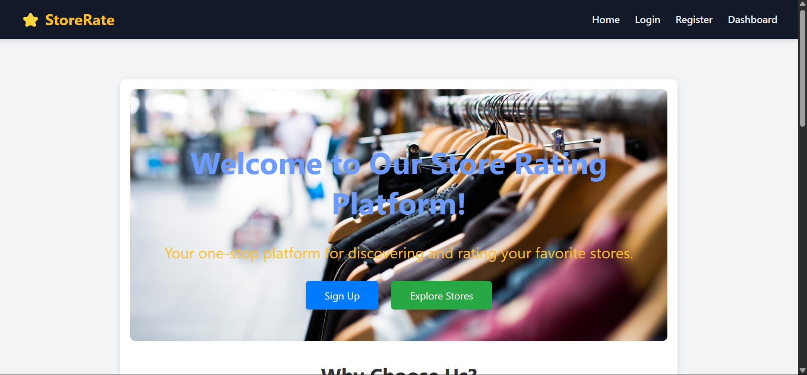
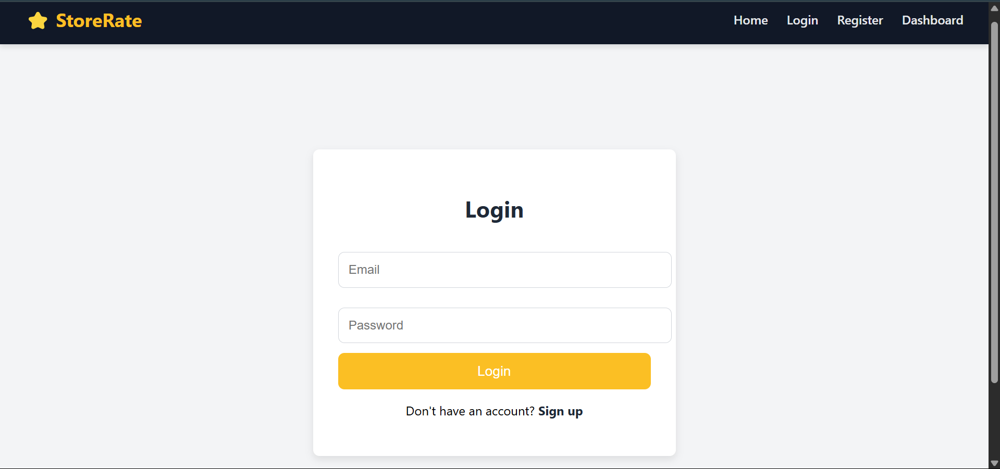
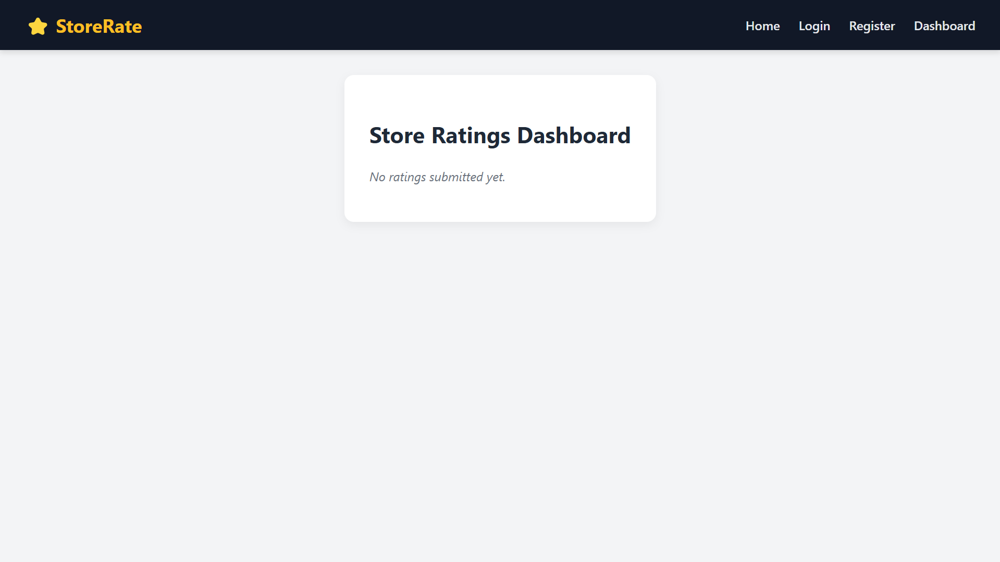
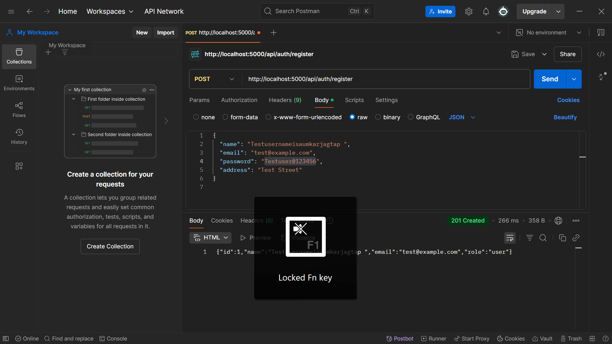
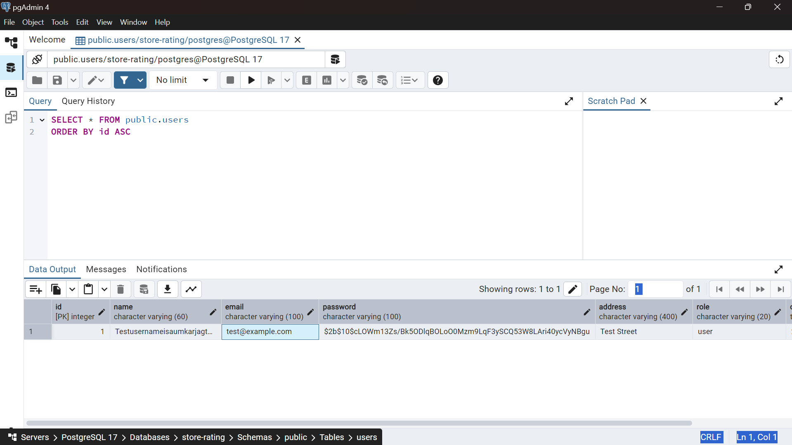

# 🏪 Store Rating App

## 🌟 Welcome to Store Rating App

The **Store Rating App** is a full-stack platform that empowers users to discover and rate local stores while giving store owners insight into customer satisfaction. It's fast, intuitive, and visually appealing.

---

## 🚀 Features at a Glance

✨ **User Roles**
- 👤 Normal User: Can browse and rate stores  
- 🏪 Store Owner: View ratings, respond to feedback  
- 🛠️ Admin: Manage users, stores, and reviews  

📥 **Authentication**
- JWT-secured login & registration system  
- Role-based dashboard routing  

⭐ **Rating & Reviews**
- Leave a rating from 1–5 stars with an optional comment  
- View all ratings submitted for your store  

📊 **Store Dashboard**
- Store owners can view real-time feedback from customers  
- Review analytics and boost your store's presence  

🧭 **Navigation & UI**
- Responsive design  
- Smooth navigation using React Router  
- Clean, modern dashboard UI  

---

## 🖼️ Screenshots

### 🏠 Home Page

The landing page showcasing top-rated stores.

---

### 🔐 Login Page

Simple and secure authentication using JWT.

---

### 📋 Store Owner Dashboard

Shows a list of user ratings and reviews.

---

## 🧪 API Testing with Postman

All endpoints are tested using Postman to ensure functionality and response validity.

---

## 🛢️ PostgreSQL Database

The app uses **PostgreSQL** to store all user, store, and review data. Here's a peek into how your data looks in the database:

---

## 🧰 Tech Stack

**Frontend**  
- React.js  
- React Router  
- CSS  

**Backend**  
- Node.js  
- Express.js  
- PostgreSQL (via Sequelize ORM)  

**Authentication**  
- JWT (JSON Web Tokens)  

**API Testing**  
- Postman  

---

## 🧠 Highlights

- ✅ Clean code & modular structure  
- ✅ Modern UI with responsive layout  
- ✅ RESTful APIs with error handling  
- ✅ Full-stack integration with database  

---

## 🔗 Follow the Project

Want to explore or contribute? Star the repo ⭐ and fork it 🚀

---

### 🙌 Made with by [Aumkar jagtap]
